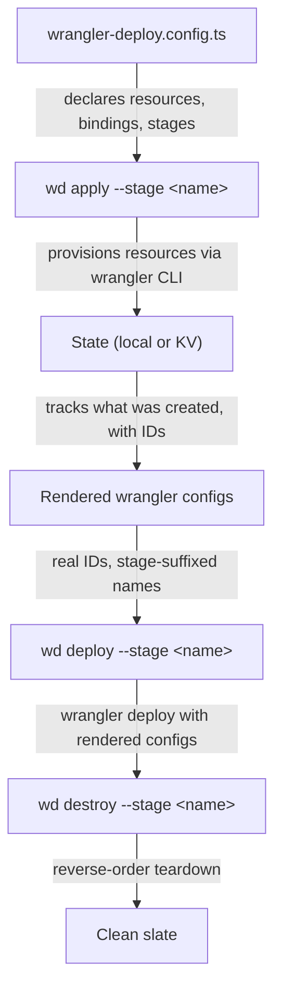

## Flow



## What happens at each step

### `wd apply`

1. Reads `wrangler-deploy.config.ts`
2. Resolves state backend (local filesystem or remote KV)
3. For each resource, calls `wrangler kv namespace create`, `wrangler d1 create`, `wrangler queues create`, etc.
4. Writes state after each resource (resumable on failure)
5. Generates a rendered `wrangler.rendered.jsonc` per worker with real IDs, stage-suffixed names, and a pinned `account_id` when the repo root is known (same resolution as `wrangler` child processes)
6. Idempotent: existing resources are adopted, not recreated

### `wd deploy`

1. Reads state to find rendered configs
2. Validates all declared secrets are set (blocks if missing)
3. Resolves deploy order from service bindings (or explicit `deployOrder`)
4. For each worker, calls `wrangler deploy -c <rendered-config>`
5. Runs from the worker directory so relative paths resolve correctly
6. Optional `--verify` runs post-deploy coherence checks

### `wd dev`

1. Uses the checked-in `wrangler.jsonc` files by default
2. When you pass `--stage <name>`, renders stage-specific configs from the applied stage state
3. Uses those rendered configs to start local workers or a shared session, so local bindings match deploy-time state
4. Keeps the original `wrangler.jsonc` files untouched

### `wd destroy`

1. Checks stage protection rules (refuses without `--force` for protected stages)
2. Removes queue consumers first (Cloudflare requires this before worker deletion)
3. Deletes workers in reverse deploy order
4. Deletes resources (queues, KV, D1, Hyperdrive, R2)
5. Handles "not found" gracefully (resources may already be gone)
6. Cleans up state

## State management

By default, state lives locally in `.wrangler-deploy/<stage>/state.json`. For teams and CI, use [remote KV state](/wrangler-deploy/features/remote-state/):

```ts
state: {
  backend: "kv",
  namespaceId: "your-kv-namespace-id",
}
```

All commands (apply, deploy, destroy, verify, secrets, gc, status) go through the same `StateProvider` interface. Switching backends is a config change.

## Authentication

wrangler-deploy uses wrangler for all Cloudflare operations. It resolves the **Cloudflare account ID** in a fixed order and passes `CLOUDFLARE_ACCOUNT_ID` into every `wrangler` subprocess so commands do not hang on account prompts.

Resolution order:

1. **`CLOUDFLARE_ACCOUNT_ID`** environment variable (32-character hexadecimal id from Workers & Pages → your account). Whitespace is trimmed; invalid shapes fail with a clear error
2. **`accountId`** in [`.wdrc` / `.wdrc.json`](/wrangler-deploy/reference/config/) (repo root or parent), if set
3. **`wrangler whoami`**, using the same environment as the process (OAuth or API token)

If both **`CLOUDFLARE_ACCOUNT_ID`** and **`.wdrc` `accountId`** are set, the **environment variable wins** for that run (useful in CI overriding a committed `.wdrc`).

If **`CLOUDFLARE_API_TOKEN`** is set and the account id still cannot be resolved from the steps above, wrangler-deploy **throws** instead of reading **`~/.wrangler/config/default.toml`**. That file reflects `wrangler login` (OAuth) and is often a *different* account than a CI or team API token. Using it together with a token commonly surfaces as **Cloudflare API error 10000** (token vs wrong account). With a token, set the account explicitly (`CLOUDFLARE_ACCOUNT_ID` or `.wdrc`) or ensure `wrangler whoami` succeeds with that token.

**Without** an API token, if `whoami` fails, wrangler-deploy may fall back to OAuth `default.toml`—the usual local-only path.

**CI/CD:** set **`CLOUDFLARE_API_TOKEN`** and provide the account id via **`CLOUDFLARE_ACCOUNT_ID`** or **`accountId`** in `.wdrc` (for example `wd context set --account-id …`). Do not rely on `default.toml` on the runner.

No separate authentication layer beyond Wrangler. If credentials and account resolution are correct, wrangler-deploy and `wrangler` agree on the target account.

## Trust boundary

`wrangler.jsonc` remains the primary authoring format. wrangler-deploy adds orchestration around it instead of replacing it. Rendered configs under `.wrangler-deploy` are generated artifacts for deploy and stage-aware local dev, not files you are meant to edit by hand.
