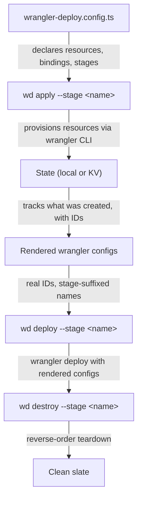

## Flow



## What happens at each step

### `wd apply`

1. Reads `wrangler-deploy.config.ts`
2. Resolves state backend (local filesystem or remote KV)
3. For each resource, calls `wrangler kv namespace create`, `wrangler d1 create`, `wrangler queues create`, etc.
4. Writes state after each resource (resumable on failure)
5. Generates a rendered `wrangler.rendered.jsonc` per worker with real IDs and stage-suffixed names
6. Idempotent: existing resources are adopted, not recreated

### `wd deploy`

1. Reads state to find rendered configs
2. Validates all declared secrets are set (blocks if missing)
3. Resolves deploy order from service bindings (or explicit `deployOrder`)
4. For each worker, calls `wrangler deploy -c <rendered-config>`
5. Runs from the worker directory so relative paths resolve correctly
6. Optional `--verify` runs post-deploy coherence checks

### `wd destroy`

1. Checks stage protection rules (refuses without `--force` for protected stages)
2. Removes queue consumers first (Cloudflare requires this before worker deletion)
3. Deletes workers in reverse deploy order
4. Deletes resources (queues, KV, D1, Hyperdrive, R2)
5. Handles "not found" gracefully (resources may already be gone)
6. Cleans up state

## State management

By default, state lives locally in `.wrangler-deploy/<stage>/state.json`. For teams and CI, use [remote KV state](/wrangler-deploy/features/remote-state/):

```ts
state: {
  backend: "kv",
  namespaceId: "your-kv-namespace-id",
}
```

All commands (apply, deploy, destroy, verify, secrets, gc, status) go through the same `StateProvider` interface. Switching backends is a config change.

## Authentication

wrangler-deploy uses wrangler for all Cloudflare operations:

- **Local**: `wrangler login` (OAuth), account ID auto-resolved from `wrangler whoami`
- **CI/CD**: `CLOUDFLARE_API_TOKEN` + `CLOUDFLARE_ACCOUNT_ID`

No separate authentication needed. If wrangler works, wrangler-deploy works.
