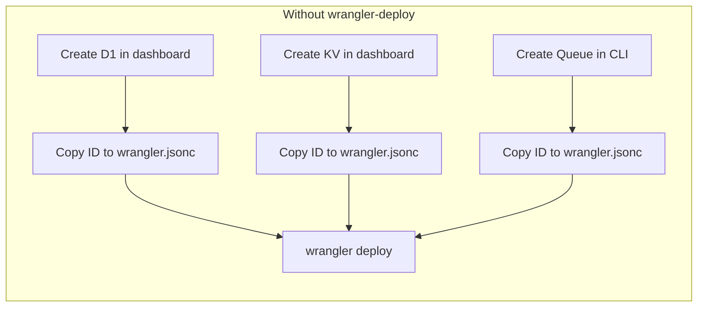
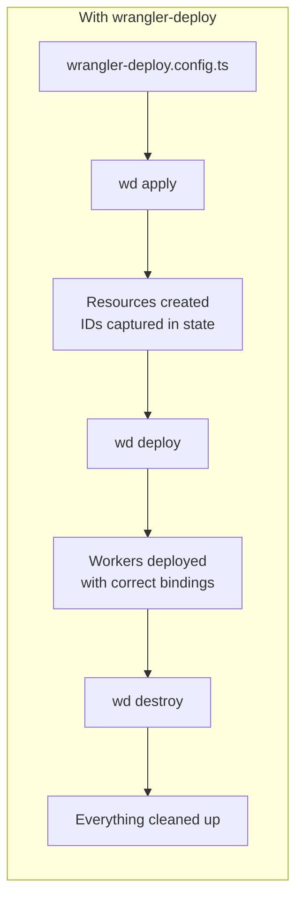
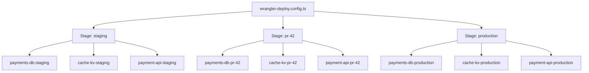

wrangler-deploy is a CLI that sits on top of wrangler. It manages the full lifecycle of a Cloudflare Workers environment: creating resources, deploying workers with the right IDs, and tearing everything down per stage.

## The problem

Every Cloudflare Workers project references KV namespaces, Queues, D1 databases, Hyperdrive configs, and service bindings by hardcoded IDs. Those IDs come from the dashboard or CLI, differ between environments, and must be copy-pasted into config files.



There is no standard way to:

- Provision all resources for a new stage in one command
- Generate deployable wrangler configs with the right IDs per stage
- Deploy workers in dependency order
- Tear down a stage cleanly
- Get typed Worker `Env` from a single config

## The solution

wrangler-deploy adds a `wrangler-deploy.config.ts` alongside your existing `wrangler.jsonc` files. It declares your resources and bindings, then provides lifecycle commands.



### Commands

```bash
wd init          # scan existing wrangler configs
wd plan          # dry-run, show what would change
wd apply         # provision resources
wd deploy        # deploy workers in dependency order
wd verify        # post-deploy health checks
wd destroy       # reverse-order teardown
```

Your `wrangler.jsonc` files stay untouched and independently deployable for `wrangler dev`.

## How stages work

A stage is an isolated copy of your entire stack — resources, workers, and bindings — identified by a name like `pr-42` or `staging`. Each stage gets its own suffixed resources and its own state.



This means a PR can spin up a complete environment, test against real Cloudflare services, and tear it down when merged — without touching staging or production.

## Key principles

- **Additive** — Uses wrangler for deployment, auth, and local dev. Doesn't replace anything.
- **Zero migration** — Reads your existing `wrangler.jsonc` files. `wrangler dev` still works.
- **Type-safe** — Phantom `Env` types from config. Full `D1Database`, `KVNamespace`, `Queue` types without codegen.
- **Safe by default** — Stage protection, resumable operations, dependency-ordered teardown.
- **Team-ready** — Remote state via Cloudflare KV. Dev A applies, Dev B deploys, CI destroys.
