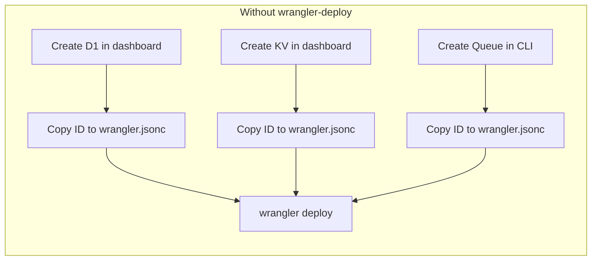
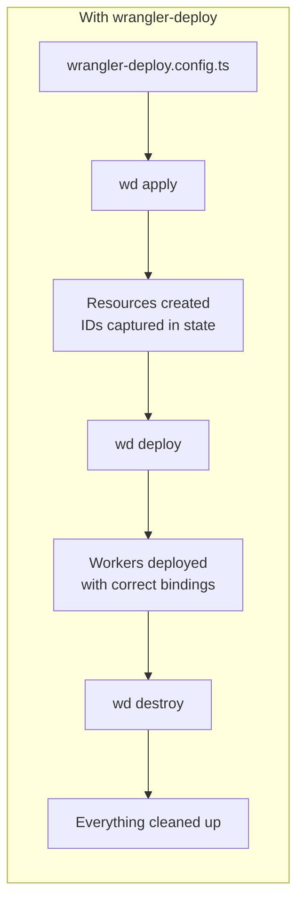
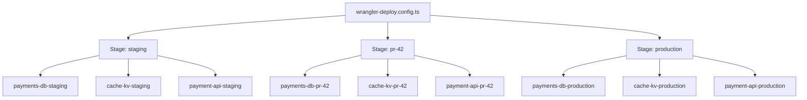

wrangler-deploy sits on top of wrangler. It is a deploy tool, but it is also a development tool for projects that already live in `wrangler.jsonc`. You keep your existing config files, keep using `wrangler dev`, and add one file at the repo root: `wrangler-deploy.config.ts`.

That extra file tells wrangler-deploy what resources exist, which workers use them, and how stages should behave. From there it can create stage-specific resources, render stage-specific `wrangler.jsonc` files with the right IDs, deploy in the right order, and tear everything down when the stage is done.

## The problem

Cloudflare Workers projects usually start with `wrangler.jsonc`, then grow into something messier. A second worker gets added. Then a queue. Then D1. Then a preview environment. At that point the hard part is not writing the worker code. It is keeping IDs, bindings, deploy order, and cleanup steps straight across environments.

`wrangler.jsonc` is still the right source for local development. The problem is that raw Wrangler does not give you a good way to treat a whole multi-worker app as one stageable system.



There is no standard way to:

- Provision all resources for a new stage in one command
- Keep `wrangler.jsonc` as the source of truth for dev, while generating deployable configs per stage
- Deploy workers in dependency order
- Tear down a stage cleanly
- Get typed Worker `Env` from a single config

## The solution

You add `wrangler-deploy.config.ts` next to your existing `wrangler.jsonc` files. That file does not replace Wrangler config. It complements it.

- Your checked-in `wrangler.jsonc` stays readable and dev-friendly.
- wrangler-deploy renders stage-specific `wrangler.rendered.jsonc` files when it needs real IDs and stage-suffixed names.
- `wrangler dev` still uses the files you already have.
- `wd deploy` uses the rendered files built for that stage.



### Commands

```bash
wd init          # scan existing wrangler.jsonc files
wd plan          # dry-run, show what would change
wd apply         # provision resources
wd deploy        # deploy workers in dependency order
wd verify        # post-deploy health checks
wd destroy       # reverse-order teardown
```

The important split is simple:

- Dev keeps using your existing `wrangler.jsonc`.
- Deploy uses rendered `wrangler.rendered.jsonc` with real IDs for that stage.

That is why JSONC stays first-class instead of turning into something you have to work around.

## How stages work

A stage is an isolated copy of your stack: resources, workers, bindings, and state. Give it a name like `pr-42`, `staging`, or `production` and wrangler-deploy keeps that environment separate from the rest.



That gives you something Wrangler alone does not really give you out of the box: a repeatable full-environment workflow. A PR can get its own D1, KV, queues, worker names, service bindings, and cleanup path without touching staging or production.

## Key principles

- **Additive**: Wrangler still handles auth, deploy, and local dev. wrangler-deploy sits on top.
- **JSONC-first**: Your existing `wrangler.jsonc` files stay in place. No rewrite step. No migration away from Wrangler.
- **Built for both dev and deploy**: Keep using `wrangler dev` or `wd dev` locally, then use the same project definition for staged deploys.
- **Type-safe**: Worker `Env` types come from config. No generated files to commit.
- **Safe by default**: Protected stages, resumable apply, dependency-aware deploy and destroy order.
- **Usable in teams**: Put state in KV and let local dev, CI, and teammates operate on the same stage without guessing.
